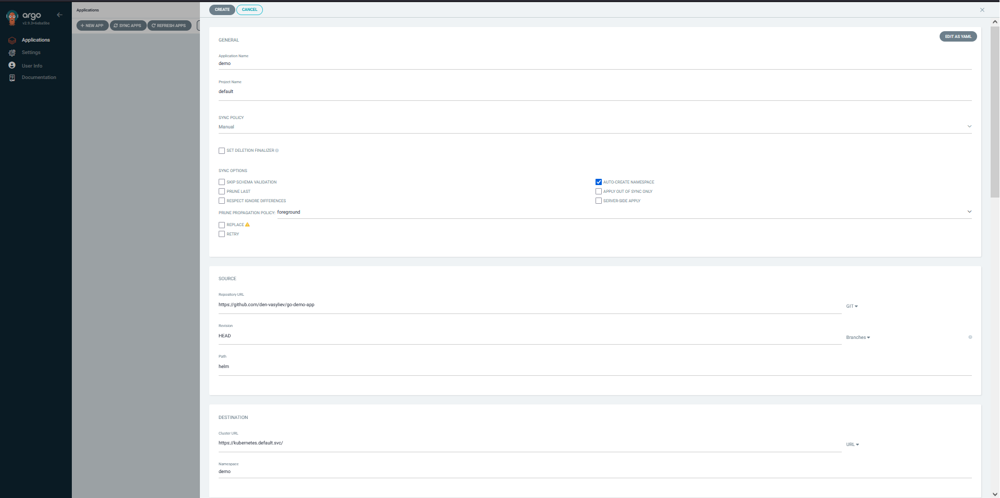
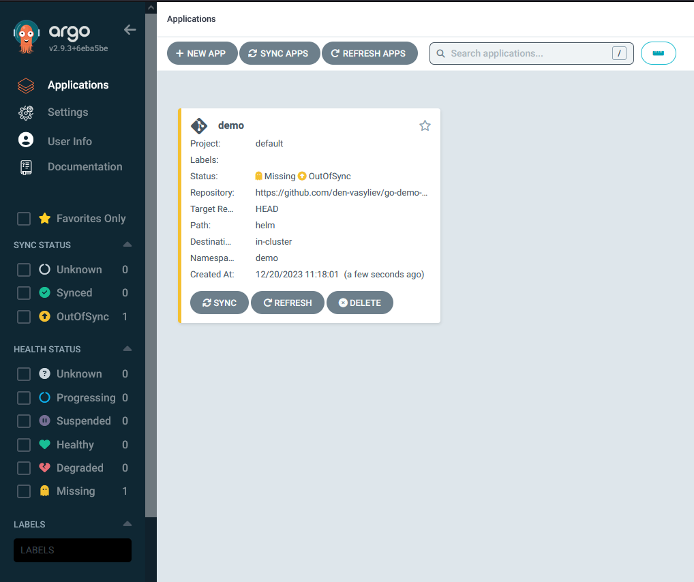
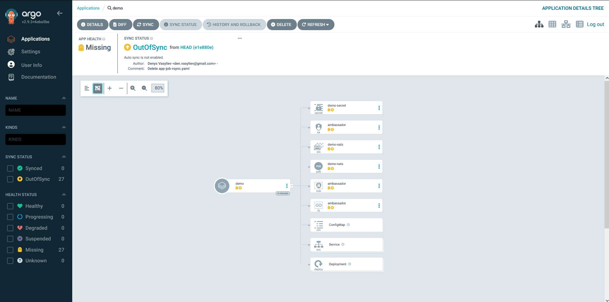
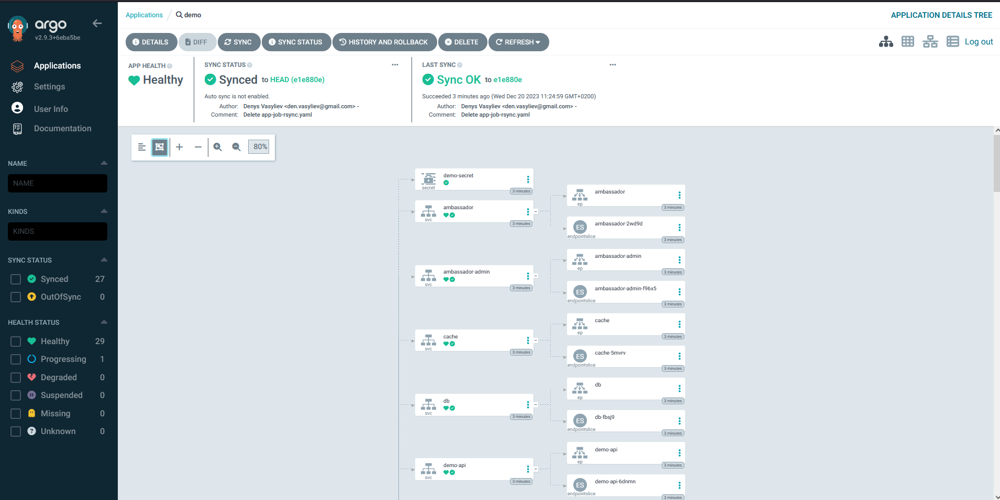
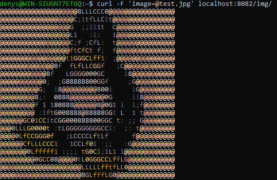

# AsciiArtify. Minimum Viable Product

> Configuring the application that will be automatically deployed in Kubernetes

1. In the ArgoCD panel click `+ NEW APP`
2. In the modal window that opens, fill in the fields:

   - **Applicaton Name:** desired name
   - **Project Name:** default
   - **AUTO-CREATE NAMESPACE:** ✓
   - **Repository URL:** a link to the repository containing the manifests for deployment
   - **Revision:** HEAD
   - **Path:** helm
   - **Cluster URL:** [https://kubernetes.default.svc](https://kubernetes.default.svc/)
   - **Namespace:** demo
  
   
   
4. Click `CREATE`

   As a result, the added application will be displayed on the panel:

   

5. Review the details of the application by clicking on the block **Demo.**

   

6. ArgoCD application has been created, but not yet deployed. Deploy it by performing the first synchronization by clicking the `Sync` button and selecting all components from the list in this case.

   

   The statuses will change to **Healthy**, **Syned**, **Sync OK**, this will mean that the project is fully deployed and the state of the source code matches the state in the repository.

7. Test the application.

   - Return the `NodePort` value and make sure that everything is synchronized.
   - Set up port-forwarding for `ambassador`

     ```bash
     kubectl port-forward -n demo svc/ambassador 8082:80&
     ```
   - Check access

     ```bash
     curl localhost:8082
     ```
   - Upload image

     ```bash
     curl -F 'image=@test.jpg' localhost:8082/img/
     ```
     The app transforms the image into ASCII art

     Original:

     

     Result:

     

